# 🎬Final PJT  - 전호정, 최명재

## 목표

> - 영화 정보 기반 추천 서비스 구성
> - 커뮤니티 서비스 구성
> - HTML, CSS, JavaScript, Vue.js, Django, REST API, DataBase 등을 활용한 실제 서비스 설계
> - 서비스 관리 및 유지 보수


## 소소영화(SSHOWMOVIE)

>소소한 일상속에서 재미를 주는 영화콘텐츠 제공 & 커뮤니티 사이트


## 개발 기간

- 2021.11.17 ~ 2021.11.25


## 개발환경

- Django
- Python
- Vue.js
- Vuetify
- JavaScript
- Jira Software
- Figma


# 업무 분담 

- 전호정 - Backend의 accounts와 reviews, comments / Frontend의 signup, login, profile, 영화 리스트 출력, comment CRUD/ CSS
- 최명재 -Backend의 API 데이터 가져오기, movies, rates / Frontend의 Detail, review CRUD, Rate CRUD/ CSS


## 결과물

- 로그인, 회원 가입 창


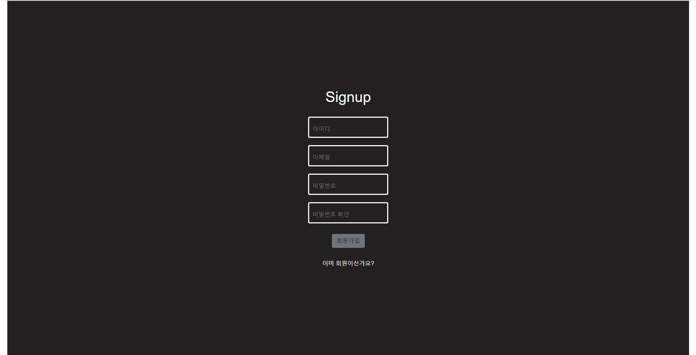

- 메인 페이지

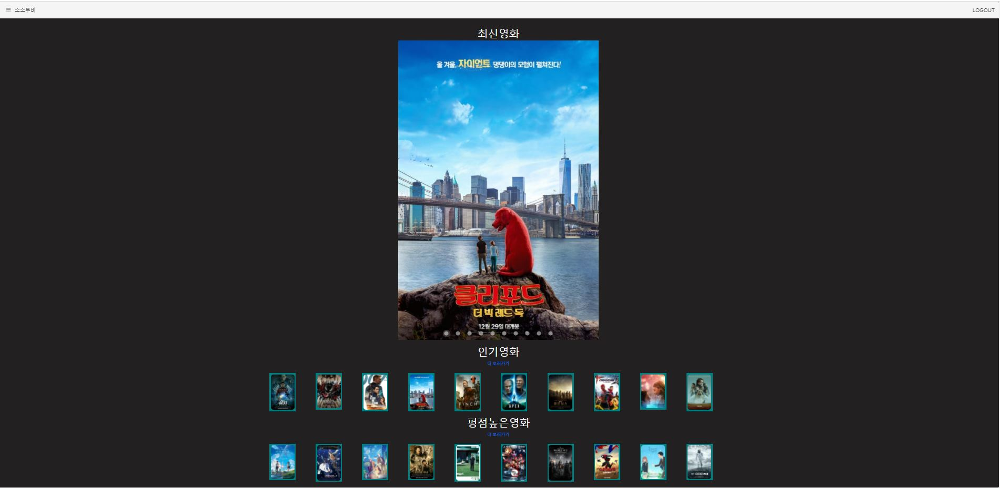

- 영화 상세 페이지(영화 정보, 리뷰, 평점)

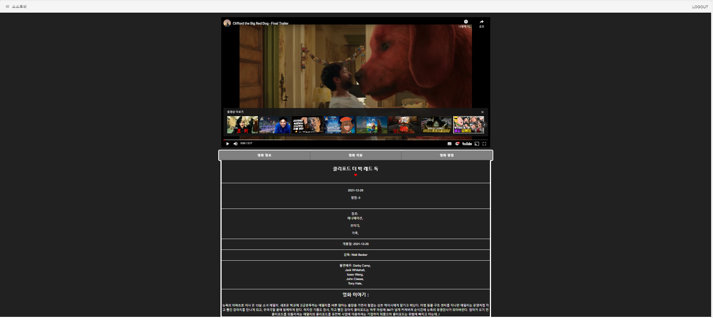

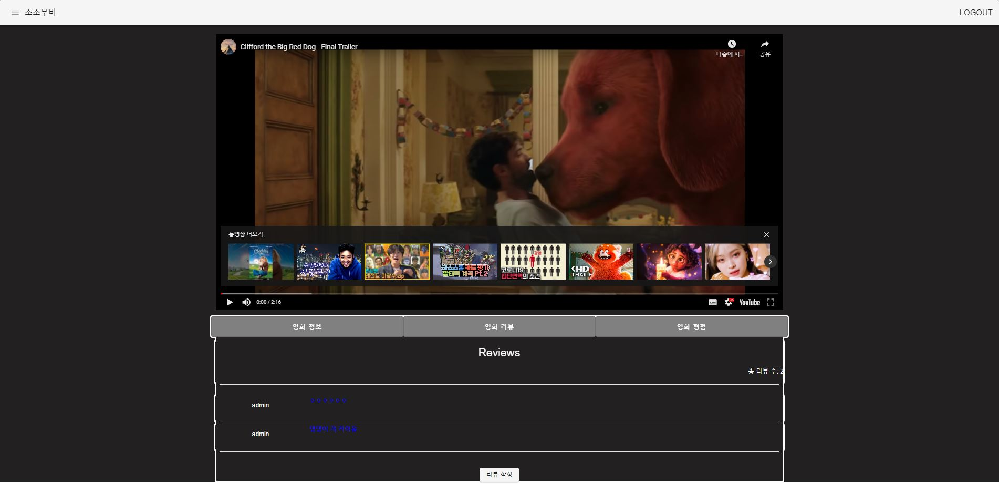

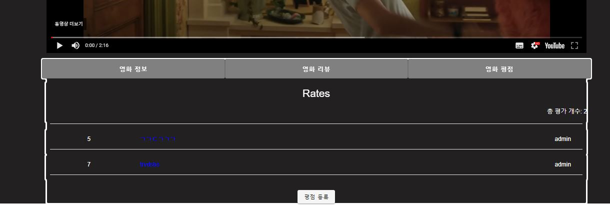

- 프로필 페이지

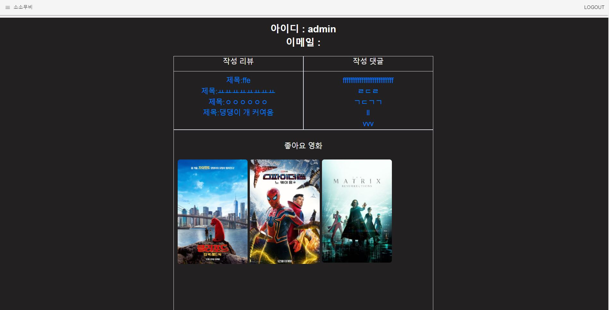

- 영화 리스트

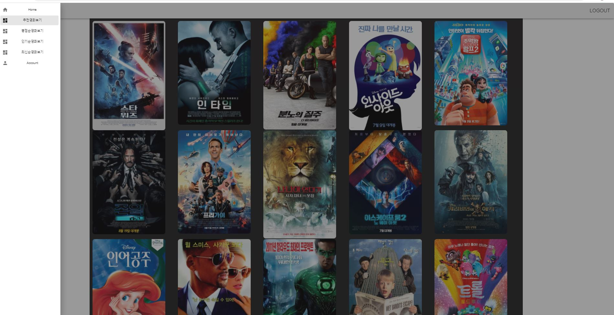

- 관리자 페이지

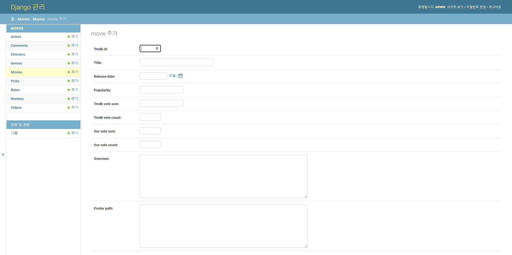


## 디자인 설계

### 1. 페르소나 👨‍👩‍👧‍👦

- 영화를 좋아하고 자신의 취향과 생각을 공유하고 소통하고 싶은 유저

  => 좋아요를 누른 영화와 비슷한 장르의 영화를 추천 해주는 것이 목표이자 주제!


### 2. Web Page Design 👩‍🎨

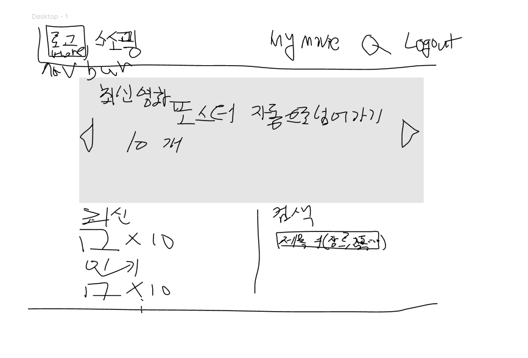

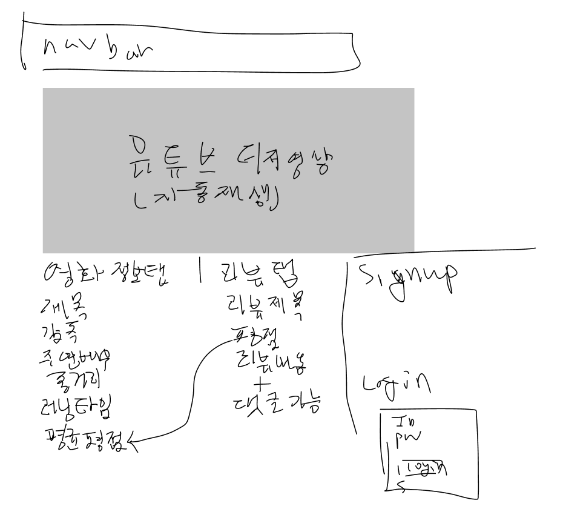


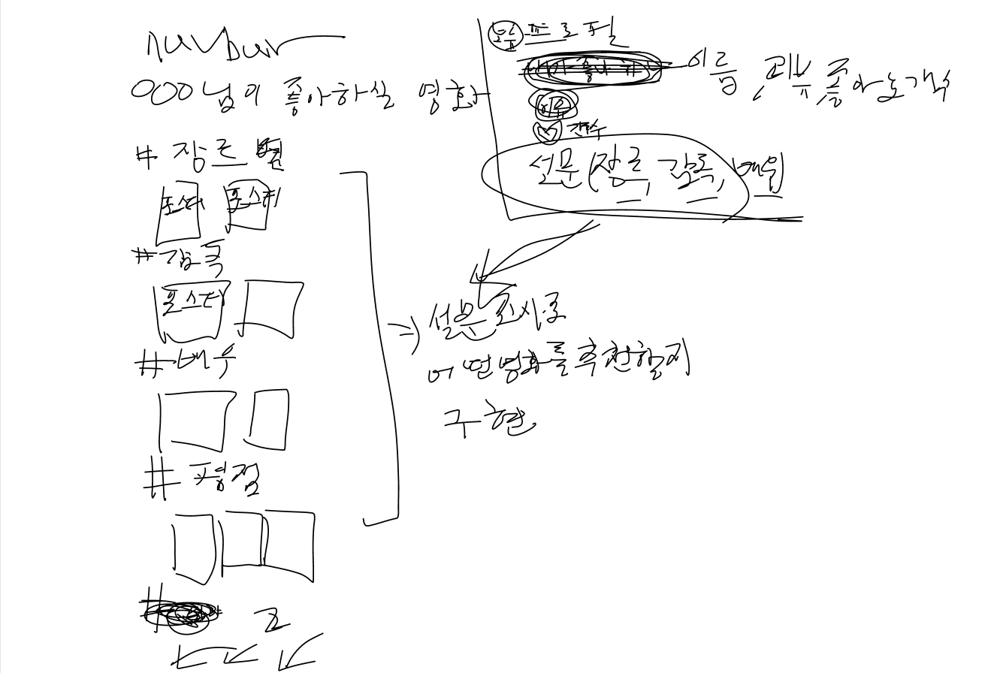


- Figma를 통해 디자인을 구상
- 초기 디자인은 여러가지 기획을 구상

- 하지만 시간 부족으로 인해 이를 완전히 구현하지 못했다.
- 검색, 좋아하는 장르 설문 페이지, 배우 및 감독 별 영화 추천은 구현하지 못함


### 3. Jira

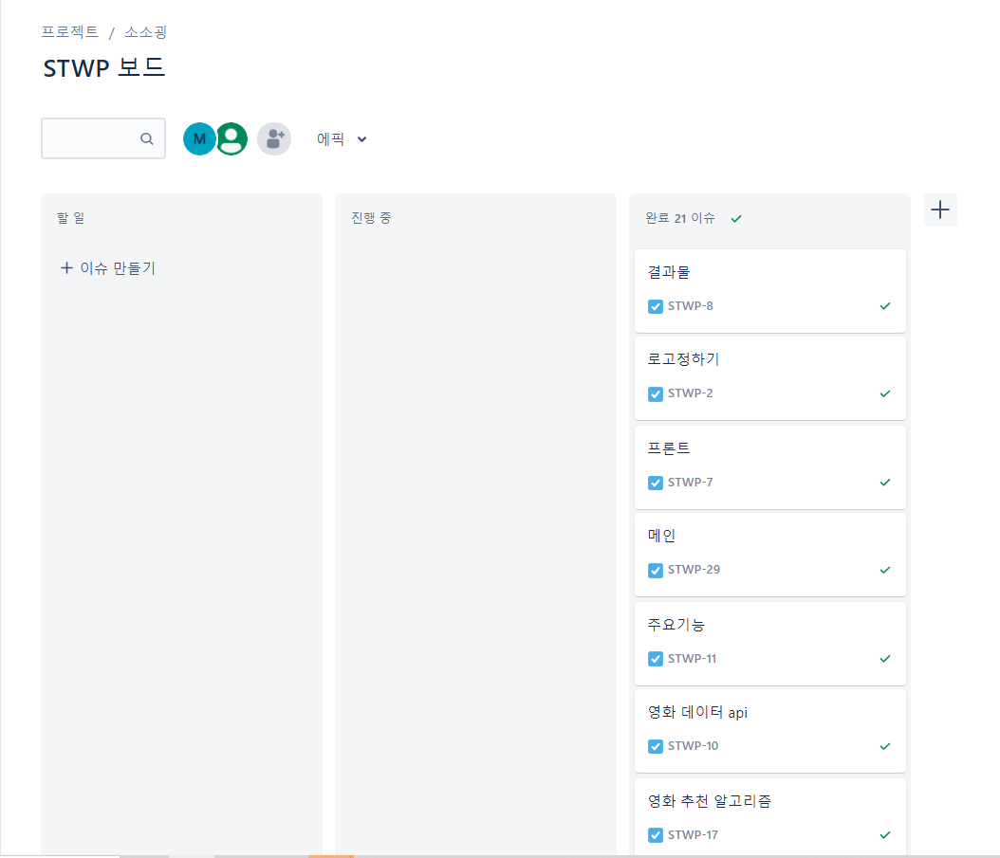

- Jira를 통해서 해야할 일을 나누고 진행상태와 완료 상태를 체크했다.


### 4. ERD

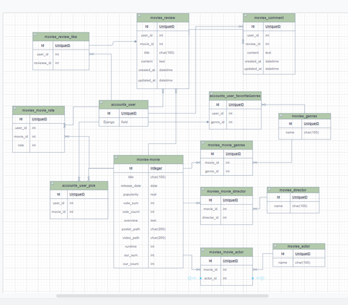


## 주요 코드

### 1. Back-end

#### 1. Movies

##### 1. Settings.py

- jwt 토큰을 사용하기 위해서 settings.py에 아래와 같은 코드를 입력

```python
...
REST_FRAMEWORK = {
    'DEFAULT_PERMISSION_CLASSES': (
        'rest_framework.permissions.IsAuthenticated',
    ),
    'DEFAULT_AUTHENTICATION_CLASSES': (
        'rest_framework_jwt.authentication.JSONWebTokenAuthentication',
    ),
}


import datetime

JWT_AUTH = {
    'JWT_EXPIRATION_DELTA': datetime.timedelta(days=1),
}

```

##### 2. Models.py

- ERD에 나온대로 영화, 배우, 감독, 리뷰, 댓글, 평점, 선택한 영화의 모델을 만들었다.
- 유저 정보가 필요한 리뷰, 댓글, 평점, 선택한 영화는 user모델을 외래키로 연결해주었다. 
- 평점은 1-10점만 줄 수 있도록 Validator를 통해 제한을 주었다.
- tmdb API에서 사용하는 id와 우리가 사용하는 id는 다르기 때문에 모델에서 이를 선언해주었다.

```python
from django.db import models
from django.conf import settings
from django.db.models.fields import FloatField
from django.core.validators import MaxValueValidator, MinValueValidator

class Movie(models.Model):
    tmdb_id = models.IntegerField()
    title = models.CharField(max_length=100)
    release_date = models.DateField()
    popularity = models.FloatField()
    tmdb_vote_sum = models.FloatField()
    tmdb_vote_count = models.IntegerField()
    our_vote_sum = models.IntegerField()
    our_vote_count = models.IntegerField()
    overview = models.TextField()
    poster_path = models.TextField()
    
    def __str__(self):
        return self.title

class Genre(models.Model):
    movies = models.ManyToManyField(Movie, related_name='genres')
    tmdb_genre_id = models.IntegerField()
    name = models.CharField(max_length=100)
    
    def __str__(self):
        return self.name
    
class Director(models.Model):
    movies = models.ManyToManyField(Movie, related_name='directors')
    name = models.CharField(max_length=100)
    
    def __str__(self):
        return self.name

class Actor(models.Model):
    movies = models.ManyToManyField(Movie, related_name='actors')
    name = models.CharField(max_length=100)
    
    def __str__(self):
        return self.name

class Video(models.Model):
    movie = models.ForeignKey(Movie, on_delete=models.CASCADE, related_name='videos')
    video_keys = models.CharField(max_length=100)
    
    def __str__(self):
        return self.video_keys

class Review(models.Model):
    user = models.ForeignKey(settings.AUTH_USER_MODEL, on_delete=models.CASCADE, related_name='reviews')
    movie = models.ForeignKey(Movie, on_delete=models.CASCADE, related_name='reviews')
    title = models.CharField(max_length=100)
    content = models.TextField()
    created_at = models.DateTimeField(auto_now_add=True)
    updated_at = models.DateTimeField(auto_now=True)
    is_opened=models.BooleanField(default=False)
    
    def __str__(self):
        return self.title

class Comment(models.Model):
    user = models.ForeignKey(settings.AUTH_USER_MODEL, on_delete=models.CASCADE, related_name='comments')
    review = models.ForeignKey(Review, on_delete=models.CASCADE, related_name='comments')
    content = models.TextField()
    created_at = models.DateTimeField(auto_now_add=True)
    updated_at = models.DateTimeField(auto_now=True)
    
    def __str__(self):
        return self.content


class Rate(models.Model):
    user = models.ForeignKey(settings.AUTH_USER_MODEL, on_delete=models.CASCADE, related_name='rates')
    movie = models.ForeignKey(Movie, on_delete=models.CASCADE, related_name='rates')
    rate = models.FloatField(validators=[MinValueValidator(1), MaxValueValidator(10)])
    short_comment = models.CharField(max_length=100)
    
    def __str__(self):
        return f'평점: {self.rate} / 한줄평: {self.short_comment}'
    
class Pick(models.Model):
    user = models.ForeignKey(settings.AUTH_USER_MODEL, on_delete=models.CASCADE, related_name='my_movies')
    movie = models.ForeignKey(Movie, on_delete=models.CASCADE, related_name='pick_user')
    title = models.CharField(max_length=100)
    poster_path = models.TextField()
```

##### 3. Serializers.py

- 배우, 감독, 동영상 경로, 리뷰는 영화 모델에 없기 때문에 MovieSerializer 안에서 이에 대한 serializer를 선언해주어 데이터를 출력해주었다.

```python
from django.contrib.auth import get_user_model
from rest_framework import serializers
from .models import  Movie, Review, Genre, Director, Actor, Comment, Video,Rate, Pick
from accounts.serializers import UserSerializer


class ActorSerializer(serializers.ModelSerializer):
    
    class Meta:
        model = Actor
        fields = ('id', 'name',)

class DirectorSerializer(serializers.ModelSerializer):
  
    class Meta:
        model = Director
        fields = ('id', 'name',)

class GenreSerializer(serializers.ModelSerializer):
    
    class Meta:
        model = Genre
        fields = '__all__'

class VideoSerializer(serializers.ModelSerializer):
    
    class Meta:
        model = Video
        fields = '__all__'
        
class CommentSerializer(serializers.ModelSerializer):
    user=UserSerializer(read_only=True)
    class Meta:
        model = Comment
        fields = ('id', 'review', 'user','content', 'created_at', 'updated_at',)
        read_only_fields = ('review',)
        
class ReviewSerializer(serializers.ModelSerializer):
    comments = CommentSerializer(many=True, read_only=True)
    comments_count = serializers.IntegerField(source='comments.count', read_only=True)
    user=UserSerializer(read_only=True)
    
    class Meta:
        model = Review
        fields = ('id', 'movie', 'user', 'content', 'created_at', 'updated_at', 'comments', 'comments_count', 'title', )
        read_only_fields = ('movie',)
        
class MovieListSerializer(serializers.ModelSerializer):
    
    class Meta: 
        model = Movie
        fields = ('id', 'tmdb_id', 'title', 'poster_path', 'genres', 'popularity' )
        
class RateSerializer(serializers.ModelSerializer):
    
    user = UserSerializer(read_only=True)
    
    class Meta:
        model = Rate
        fields = ('id', 'movie', 'user', 'short_comment', 'rate')
        read_only_fields = ('movie',)

class MovieSerializer(serializers.ModelSerializer):
    reviews = ReviewSerializer(many=True, read_only=True)
    reviews_count = serializers.IntegerField(source = 'reviews.count', read_only=True)
    videos = VideoSerializer(many=True, read_only=True)
    actors = ActorSerializer(many=True, read_only=True)
    directors = DirectorSerializer(many=True, read_only=True)
    genres = GenreSerializer(many=True, read_only=True)

    class Meta:
        model = Movie
        fields = ('id', 'tmdb_id', 'title', 'release_date', 'popularity', 'tmdb_vote_sum', 'tmdb_vote_count', 'our_vote_sum', 'our_vote_count', 'overview', 'poster_path', 'videos', 'reviews', 'reviews_count','actors', 'genres', 'directors', 'rates',)
        
    
class PickSerializer(serializers.ModelSerializer):
 
    class Meta:
        model = Pick
        fields = ('id', 'user', 'movie', 'title', 'poster_path')
        read_only_fields = ('user', 'movie', 'poster_path', 'title',)
```

##### 4. Views.py

- 영화 데이터 입력
- TMDB API를 통해 장르별, 영화 상세별, 배우별, 감독별, 영상별로 데이터들을 서버에 저장해주었다.
- 관리자만 API를 통해 데이터를 저장할 수 있도록 if문을 걸어주었다. 
- jwt 토큰에 걸리지 않도록 `@permission_classes([AllowAny])`를 설정해주었다.

```python
## 장르
@api_view(['POST'])
@permission_classes([AllowAny])
def upload_genres_all(request):
    if request.data.get('username') == 'admin':
        API_KEY = 'cf85387cb23102d7dcdbb033efadd2e5' 
        url = f'https://api.themoviedb.org/3/genre/movie/list?api_key={API_KEY}&region=KR&language=ko'
        res = requests.get(url).json()
        
        for data in res.get('genres'):
            Genre.objects.create(
                tmdb_genre_id = data.get('id'),
                name = data.get('name'),
            )
        return Response({ 'database' : '성공적으로 데이터를 등록했습니다.'})
    return Response({ 'Unauthorized': '권한이 없습니다'}, status=status.HTTP_403_FORBIDDEN)

## 영화 정보
@api_view(['POST'])
@permission_classes([AllowAny])
def upload_movies_all(request):
    if request.data.get('username') == 'admin':
        API_KEY = 'cf85387cb23102d7dcdbb033efadd2e5'
        for page in range(1, 31):
            url = f'https://api.themoviedb.org/3/movie/popular?api_key={API_KEY}&page={page}&region=KR&language=ko'
            res = requests.get(url).json()
            
            for data in res.get('results'):
                if Movie.objects.filter(title=data.get('title')).exists():
                    movie = Movie.objects.get(title=data.get('title'))
                    movie.popularity = data.get('popularity')
                    movie.tmdb_vote_sum = data.get('vote_average') * data.get('vote_count')
                    movie.tmdb_vote_count = data.get('vote_count')
                    movie.save()
                else: 
                    movie = Movie.objects.create(
                        tmdb_id = data.get('id'),
                        title = data.get('title'),
                        release_date = data.get('release_date'),
                        popularity = data.get('popularity'),
                        tmdb_vote_sum = float(data.get('vote_average')) * float(data.get('vote_count')),
                        tmdb_vote_count = data.get('vote_count'),
                        our_vote_sum = 0,
                        our_vote_count = 0,
                        overview =  data.get('overview'),
                        poster_path = 'https://image.tmdb.org/t/p/w500' + data.get('poster_path'),
                        # video_path = '',
                        # runtime = data.get('runtime')
                    )
                    for genre_id in data.get('genre_ids'):
                        genre = Genre.objects.get(tmdb_genre_id = genre_id)
                        genre.movies.add(movie)
                        
        return Response({ 'database' : '성공적으로 데이터를 등록했습니다.'})
    return Response({ 'Unauthorized': '권한이 없습니다'}, status=status.HTTP_403_FORBIDDEN)

## 감독, 배우
@api_view(['POST'])
@permission_classes([AllowAny])
def upload_credits_all(request):
    if request.data.get('username') == 'admin':
        API_KEY = 'cf85387cb23102d7dcdbb033efadd2e5'
        movies = get_list_or_404(Movie)
        
        for movie in movies:
            url = f'https://api.themoviedb.org/3/movie/{movie.tmdb_id}/credits?api_key={API_KEY}&region=KR&language=ko'
            res = requests.get(url).json()
            
            for credits in res.get('cast')[:5]:
                if not Actor.objects.filter(name=credits.get('name')).exists() and credits.get('known_for_department') == 'Acting':
                    actor = Actor.objects.create(name=credits.get('name'))
                    actor.movies.add(movie)
            
            for credits in res.get('crew'):
                if not Director.objects.filter(name=credits.get('name')).exists() and credits.get('job') == 'Director':
                    director = Director.objects.create(name=credits.get('name'))
                    director.movies.add(movie)    
        
        return Response({ 'database' : '성공적으로 데이터를 등록했습니다.'})
    return Response({ 'Unauthorized': '권한이 없습니다'}, status=status.HTTP_403_FORBIDDEN)

## 비디오 키
@api_view(['POST'])
@permission_classes([AllowAny])
def upload_videos_all(request):
    if request.data.get('username') == 'admin':
        API_KEY = 'cf85387cb23102d7dcdbb033efadd2e5'
        movies = get_list_or_404(Movie)
        
        for movie in movies:
            url = f'https://api.themoviedb.org/3/movie/{movie.tmdb_id}/videos?api_key={API_KEY}&region=KR'
            res = requests.get(url).json()
            
            for videos in res.get('results'):
                if not Video.objects.filter(video_keys=videos.get('key')).exists() and videos.get('type') == 'Trailer':
                    video = Video.objects.create(video_keys=videos.get('key'), movie_id=movie.id)
                    
        return Response({ 'database' : '성공적으로 데이터를 등록했습니다.'})            
    return Response({ 'Unauthorized': '권한이 없습니다'}, status=status.HTTP_403_FORBIDDEN)
```

- 데이터 CRUD
- 영화, 리뷰, 댓글, 평점 등을 조회, 삭제, 수정, 생성할 수 있도록 만듦

```python
from django.contrib.auth import get_user_model
import requests
from django.shortcuts import get_list_or_404, get_object_or_404
from rest_framework import serializers
from .models import  Movie, Review, Genre, Director, Actor, Comment, Video, Rate, Pick
from .serializers import MovieListSerializer, MovieSerializer, ActorSerializer, DirectorSerializer, ReviewSerializer, GenreSerializer, CommentSerializer, VideoSerializer, RateSerializer, PickSerializer
from django.contrib.auth import get_user_model
from rest_framework.response import Response
from rest_framework.decorators import api_view, permission_classes
from rest_framework import status
from django.core.paginator import Paginator
from django.db.models import F
from rest_framework.decorators import permission_classes
from rest_framework.permissions import AllowAny

User=get_user_model()

# Create your views here.
# 메인 페이지
# 영화 조회
@api_view(['GET'])
def get_movies_all(request):
    mode=request.GET.get('mode')
    if mode=='release_date':
        movies = Movie.objects.order_by('-release_date')
    elif mode=='popularity':
        movies = Movie.objects.order_by('-popularity')
    elif mode=='vote_average':
        movies = Movie.objects.annotate(vote_average=(F('tmdb_vote_sum') + F('our_vote_sum')) / (F('tmdb_vote_count') + F('our_vote_count'))).order_by('-vote_average')
    serializer = MovieListSerializer(movies, many=True)
    return Response(serializer.data)


# 영화 상세 페이지
# 단일 영화 정보
@api_view(['GET'])
def get_movie_detail(request, movie_pk):
    movie = get_object_or_404(Movie, pk=movie_pk)
    serializer = MovieSerializer(movie)
    return Response(serializer.data)

# 감독 정보
@api_view(['GET'])
def get_directors_all(request, movie_pk):
    directors = Director.objects.filter(director_movie_pk=movie_pk)
    serializer = DirectorSerializer(directors, many=True)
    return Response(serializer.data)

# 배우 정보
@api_view(['GET'])
def get_actors_all(request, movie_pk):
    actors = Actor.objects.filter(actor_movie_pk=movie_pk)
    serializer = ActorSerializer(actors, many=True)
    return Response(serializer.data)

# 영상 정보
@api_view(['GET'])
def get_videos_all(request, movie_pk):
    videos = Video.objects.filter(pk = movie_pk)
    serializer = VideoSerializer(videos, many=True)
    return Response(serializer.data)

# 내 리뷰 가져오기
@api_view(['GET'])
def get_my_reviews(request,user_pk):
    if request.method=='GET':
        reviews = Review.objects.filter(user_id=user_pk).order_by('-pk')
        serializer=ReviewSerializer(reviews,many=True)
        data=serializer.data
        return Response(data)

# 내 댓글 가져오기
@api_view(['GET'])
def get_my_comments(request,user_pk):
    if request.method=='GET':
        comments = Comment.objects.filter(user_id=user_pk).order_by('-pk')
        serializer=CommentSerializer(comments,many=True)
        data=serializer.data
        return Response(data)

#내가 좋아요한 영화 가져오기
@api_view(['GET'])
def get_my_movies(request,user_pk):
    if request.method=='GET':
        pick_list= Pick.objects.filter(user_id=user_pk).order_by('-pk')
        serializer = PickSerializer(pick_list, many=True)
        data = serializer.data
        return Response(data)

# 영화 좋아요
@api_view(['GET', 'POST', 'DELETE'])
def pick_movie(request, movie_pk):
    if request.method == 'GET':
        pick_movie = Pick.objects.filter(user__pk=request.user.pk, movie__pk=movie_pk).first()
        serializer = PickSerializer(pick_movie)
        print(serializer)
        return Response(serializer.data)
    elif request.method == 'POST':
        movie = get_object_or_404(Movie, pk=movie_pk)
        serializer = PickSerializer(data=request.data)
        if serializer.is_valid():
            serializer.save(user=request.user, movie=movie, poster_path=movie.poster_path, title=movie.title)
            return Response(serializer.data, status=status.HTTP_201_CREATED)
    elif request.method == 'DELETE':
        photo_ticket = Pick.objects.filter(user__pk=request.user.pk, movie__pk=movie_pk).first()
        photo_ticket.delete()
        data = {
            'delete' : '좋아요 해제'
        }
        return Response(data, status=status.HTTP_204_NO_CONTENT)

# 리뷰 조회 및 생성
@api_view(['GET', 'POST'])
def get_reviews_all(request, movie_pk):
    movie = get_object_or_404(Movie, pk = movie_pk)
    # 리뷰 읽기(페이지네이터 사용)
    if request.method == 'GET':
        reviews = Review.objects.filter(movie_id=movie_pk).order_by('-pk')
        serializer = ReviewSerializer(reviews, many=True)
        return Response(serializer.data)

    # 리뷰 생성
    elif request.method == 'POST':
        serializer = ReviewSerializer(data=request.data)
        if serializer.is_valid(raise_exception=True):
            serializer.save(user=request.user, movie=movie)
            return Response(serializer.data, status=status.HTTP_201_CREATED)


# # 리뷰 삭제 및 수정
@api_view(['GET', 'DELETE', 'PUT'])
def get_review_detail(request, review_pk):
    review = get_object_or_404(Review, pk = review_pk)
    
    if request.method == 'GET':
        serializer = ReviewSerializer(review)
        return Response(serializer.data)
    
    # 리뷰를 작성한 유저와 요청한 유저가 같을 때 수정 및 삭제 가능
    elif request.user == review.user:
        # 리뷰 삭제
        if request.method == 'DELETE':
            review.delete()
            data = {
                'delete': f'{review_pk}번 리뷰가 삭제되었습니다.'
            }
            return Response(data, status=status.HTTP_204_NO_CONTENT)
        # 리뷰 수정
        elif request.method == 'PUT':
            serializer = ReviewSerializer(review, data=request.data)
            if serializer.is_valid(raise_exception=True):
                serializer.save()
                return Response(serializer.data)
    
    # 리뷰를 작성한 유저와 요청한 유저가 달라 권한이 없다
    return Response({ 'Unauthorized': '권한이 없습니다.'}, status=status.HTTP_403_FORBIDDEN)

    
## 댓글 조회 및 생성
@api_view(['GET', 'POST'])
def get_comments_all(request, review_pk):
    review = get_object_or_404(Review, pk = review_pk)
    
    if request.method == 'GET':
        comments = Comment.objects.filter(review_id=review_pk).order_by('-pk')
        serializer = CommentSerializer(comments, many=True)
        return Response(serializer.data)
    
    elif request.method == 'POST':
        serializer = CommentSerializer(data=request.data)
        if serializer.is_valid(raise_exception=True):
            serializer.save(user=request.user, review=review)
            return Response(serializer.data, status=status.HTTP_201_CREATED)


# # 댓글 삭제 및 수정
@api_view(['DELETE', "PUT"])
def get_comment_detail(request, comment_pk):
    comment = get_object_or_404(Comment, pk = comment_pk)
    
    if request.user == comment.user:
        if request.method == 'DELETE':
            comment.delete()
            data ={
                'delete' : f'{comment_pk}번 댓글이 삭제되었습니다.'
            }
            return Response(data, status=status.HTTP_204_NO_CONTENT)
        
        elif request.method == 'PUT':
            serializer = CommentSerializer(comment, data=request.data)
            if serializer.is_valid(raise_exception=True):
                serializer.save()
                return Response(serializer.data)
   
    return Response({ 'Unauthorized': '권한이 없습니다.'}, status=status.HTTP_403_FORBIDDEN)


# 평점 조회 및 생성
@api_view(['GET', 'POST'])
def get_rates_all(request, movie_pk):
    movie = get_object_or_404(Movie,pk=movie_pk)
    if request.method == 'GET':
        rates = Rate.objects.filter(movie_id = movie_pk).order_by('pk')
        serializer = RateSerializer(rates, many=True)
        return Response(serializer.data)
    
    elif request.method == 'POST':
        serializer = RateSerializer(data = request.data)
        if serializer.is_valid(raise_exception=True):
            serializer.save(user=request.user, movie=movie)
            return Response(serializer.data, status=status.HTTP_201_CREATED)

# 평점 수정 삭제
@api_view(['GET','DELETE', 'PUT'])
def get_rate_detail(request, rate_pk):
    rate = get_object_or_404(Rate, pk =rate_pk)
    
    if request.method == 'GET':
        serializer = RateSerializer(rate)
        return Response(serializer.data)
    
    if request.user == rate.user:
        if request.method == 'DELETE':
            rate.delete()
            data ={
                'delete' : f'{rate_pk}번 댓글이 삭제되었습니다.'
            }
            return Response(data, status=status.HTTP_204_NO_CONTENT)

        elif request.method == 'PUT':
            serializer = RateSerializer(rate, data=request.data)
            if serializer.is_valid(raise_exception=True):
                serializer.save()
                return Response(serializer.data)
   
    return Response({ 'Unauthorized': '권한이 없습니다.'}, status=status.HTTP_403_FORBIDDEN) 
```


#### 2. accounts

##### 1.urls.py

- REST framework JWT Auth 사용하기 

```python
from django.urls import path
from rest_framework_jwt.views import obtain_jwt_token
from . import views

urlpatterns = [
    path('signup/',views.signup),
    path('api-token-auth/', obtain_jwt_token),
    path('profile/',views.profile),
]
```

##### 2.views.py

- settings.py에서 DEFAULT로 인증를 걸어뒀기 때문에 회원가입 시에는 데코레이터 사용해서 AllowAny를 줘서 인증 패스

```python
from rest_framework import status
from rest_framework.decorators import api_view,permission_classes
from rest_framework.response import Response
from rest_framework.permissions import AllowAny
from .serializers import UserSerializer,UserProfileSerializer
from django.contrib.auth import get_user_model

User=get_user_model()

@api_view(['POST'])
@permission_classes([AllowAny])
def signup(request):
    password=request.data.get('password')
    password_confirmation=request.data.get('passwordConfirmation')

    if password !=password_confirmation:
        return Response ({'error':'비밀번호가 일치하지 않습니다.'}, status=status.HTTP_400_BAD_REQUEST)

    if User.objects.filter(username=request.data.get('username')).exists():
        return Response ({'error':'이미 사용중인 아이디입니다.'},status=status.HTTP_400_BAD_REQUEST)

    if User.objects.filter(email=request.data.get('email')).exists():
        return Response({'error':'이미 사용중인 이메일입니다.'},status=status.HTTP_400_BAD_REQUEST)
    
    serializer=UserSerializer(data=request.data)

    if serializer.is_valid(raise_exception=True):
        user=serializer.save()

        user.set_password(request.data.get('password'))
        user.save()

    return Response(serializer.data,status=status.HTTP_201_CREATED)
```


### 2. Front-end

#### 1. Movies

##### 1. 추천 알고리즘

- 추천영화 페이지를 누르면 Life Cycle Hook의 created에서 내가 좋아요를 누른 영화 데이터를 서버에서 가져온다. 
- 영화 전체 데이터를 store에 `movieList` 에 저장을 해놨기 때문에 전체 데이터를 순회하면서 내가 좋아요를 누른 영화와 영화 전체 데이터에 같은 영화가 있으면 해당 영화의 장르들을 모두 `myGenres`에 저장한다. 
- 이렇게 한 이유는 영화 상세 데이터에는 장르에 대한 정보가 없고 영화 전체 데이터에는 존재하기 때문이다. 
- `myGenres`에 있는 장르가 전체 영화에서 해당 장르를 하나라도 포함하고 있으면 추천 영화인 `recommendedMovies`에 저장한다.
- 추천영화는 페이지에 들어갈 때마다 30개씩 랜덤으로 출력하도록 하기 위해서 `_.samplesize`를 통해 랜덤 추출을 했다.

```vue
<template>
  <div class="container">
    <div v-for="(image, index) in recommendedMovies" :key="index" >
      <div class="item">
        
      </div>
    </div>
  </div>
</template>

<script>
import {mapState, mapActions, mapGetters} from 'vuex'
import axios from 'axios'
import _ from 'lodash'

export default {
  name: 'RecommendMovieList',
  data: function () {
    return {
      recommendedMovies: [],
      myGenres: [],
    }
  },
  computed:{
    ...mapState([
      'username',
      'movieList',
      'userId',
    ]),
    ...mapGetters([
      'config',
    ])
  },
  methods: {
    ...mapActions([
      'getProfiles',
      'goDetail'
    ]),
    movieRecommend: function () {
      this.recommendedMovies = []
      if (this.myGenres.length !== 0) {
        this.movieList.forEach(movie => {
          if (this.myGenres.some(i => movie.genres.includes(i))) {
            this.recommendedMovies.push(movie)
            this.recommendedMovies = _.sampleSize(this.recommendedMovies, this.recommendedMovies.length)
          }
        })
        this.recommendedMovies=_.sampleSize(this.recommendedMovies,30)
      } else {
        alert('좋아하는 영화를 선택해주세요')
      }
    }
  },
  created: function() {
    axios({
      methods:'get',
      url:`http://127.0.0.1:8000/api/v1/mymovies/${this.userId}/`,
      headers:this.config,
    })
      .then(res=>{
        res.data.forEach(myMovie => {
          this.movieList.forEach(movie => {
            if (myMovie.movie === movie.id) {
              movie.genres.forEach(genre => {
                if (this.myGenres.includes(genre) === false) {
                  this.myGenres.push(genre)
                }
              })
            }
          })
        })
        this.movieRecommend()
      })
      .catch(err=>{
        console.log(err)
      })
  }
}
</script>
```

##### 2. Detail 페이지

- 탭 기능을 통해서 영화 정보, 영화 리뷰, 영화 평점을 보여줄 수 있도록 만들었다. 
- 페이지 상단에는 해당 영화의 유튜브 트레일러 영상이 자동으로 재생될 수 있도록 `autoplay`를 설정해주었다.
- 영화 정보, 영화 리뷰, 영화 평점은 하위 컴포넌트로 설정해 연결해주었다.

```vue
<template>
  <div id="detail">
    <div class="container" id="video">
      <div class="row justify-content-md-center">
        <div class="col-md-auto">
          <iframe :src="movieVideoPath"  frameborder="0" gesture="media" allow="autoplay"></iframe>
        </div>
      </div>
    </div>
    <div id="Info">
      <div class="row">
        <v-btn id="tab" class="col" text outlined x-large @click="changeComponent('MovieInfo')"><strong>영화 정보</strong></v-btn>
        <v-btn id="tab" class="col" text outlined x-large @click="changeComponent('ReviewList')"><strong>영화 리뷰</strong></v-btn>
        <v-btn id="tab" class="col" text outlined x-large  @click="changeComponent('RateList')"><strong>영화 평점</strong></v-btn>
      </div>
      <br>
      <div class="tab-item">
        <keep-alive>
          <components :is="comp"></components>
        </keep-alive>
      </div>
    </div>
  </div>
</template>

<script>
import axios from 'axios'
import ReviewList from '@/views/movies/ReviewList'
import {mapGetters, mapState} from 'vuex'
import RateList from '@/views/movies/RateList'
import MovieInfo from '@/views/movies/MovieInfo'

export default {
  name: 'Detail',
  data: function () {
    return {
      movieVideoPath: null,
      comp: 'ReviewList',
    }
  },
  components:{
    ReviewList,
    RateList,
    MovieInfo,
  },
  computed:{
    ...mapGetters([
      'config',

    ]),
    ...mapState([
      'selectedMovie',
    ]),
  },
  methods:{
    changeComponent: function (componentName) {
      this.comp = componentName
      console.log(this.comp)
    }
  },
  created: function() {
    const movieId = this.$route.params.movieId

    axios({
      method: 'get',
      url: `http://127.0.0.1:8000/api/v1/movies/${movieId}/`,
      headers:this.config,
    })
      .then((res) => {
        const videoUrl = `https://www.youtube.com/embed/${res.data.videos[0].video_keys}?autoplay=1`
        this.movieVideoPath = videoUrl
      })
  }
}
```

##### 3. Main 페이지

- 메인페이지는 최신 영화, 인기 영화, 평점이 높은 영화에 대한 포스터들이 10개만 나열되도록 만들었다.
- 해당 분류는 하위 컴포넌트로 연결하여 메인페이지에 보여지도록 만들었다. 
- 또한 '더 보러가기'를 누르면 최신 영화, 인기 영화, 평점이 높은 영화의 전체 리스트가 출력되는 페이지로 이동하도록 만들었다. 

```vue
<template>
  <div class="Main">
    <br>
    <temp/>
    <br>
    <h1>인기영화</h1>
    <b-link @click="$router.push({name:'MoviePopularIndex'})">더 보러가기</b-link>
    <ten-popular></ten-popular>
    <h1>평점높은영화</h1>
    <b-link @click="$router.push({name:'MovieVoteIndex'})">더 보러가기</b-link>
    <ten-vote></ten-vote>
  </div>
</template>

<script>
import temp from '@/components/movies/temp'
import TenPopular from '@/components/movies/TenPopular'
import TenVote from '@/components/movies/TenVote'

export default {
  name: 'Main',
  components: {
    temp,
    TenVote,
    TenPopular
  }
}
</script>
```


## 느낀점

1. 실제 구현과 목표와의 차이

- 처음 서비스를 구현할 때는 검색 기능, 배우 및 감독을 기준으로 하는 추천 알고리즘, 유저 친화적인 UI 구현 등을 구상했었다. 하지만 명세서에 요구하는 기능들을 전부 구현하고 시간이 부족해서 추가적인 기능은 장르를 통한 추천 기능과 평점 계산 알고리즘 정도 뿐이었다. 또한 CSS 부분에서는 페어와 함께 작업을 한 것이 아니라 나눠서 작업을 했더니 합쳤을 때 페이지의 구분이 이상하게 되는 문제도 발생해 이를 다시 복구하는데에도 시간을 많이 썼다. 


2. 공부의 필요성

- 서버에서 게시판에 필요한 기능을 구현하는 것보다 CSS로 게시판 디자인을 꾸미는 것이 더 어려웠다.  일이 어려웠던 가장 큰 이유는 업무를 분담하면 CSS를 금방 끝낼 줄 알았는데 CSS를 코딩하는 스타일이 서로 다르다보니 코드를 합쳤을 때 디자인이 이상하게 변하는 문제가 발생하는 것이었다. 결국 디자인을 한 사람이 전체적으로 수정해야해서 시간이 배로 들게 되었다. 이로 인해 시간이 부족해져서 CSS 디자인을 제대로 구현하지 못했다.  
- 원하는 기능을 구현하기 위해서는 Vue, CSS 등에 대한 공부가 필요하다는 것을 느꼈다. 가장 큰 예로는 너무 많은 vue 파일들이라고 생각한다. 컴포넌트도 많고 Views 파일도 많고 코드도 보면 비효율적인 코드들이 많다. 물론 시간이 좀 더 있었으면 효율화를 했겠지만 효율성을 높이기 위해서는 당연히 이에 대한 공부도 필요할 것이다. 그래도 다음 프로젝트는 Vue에 대해서 좀 알게 되었기 때문에 이번 프로젝트보다는 더 잘 할 수 있을 것이라 생각한다.


3. 이번 프로젝트를 통해 느낀점

- 최명재: 약 일주일이라는 기간 동안 영화 관련 페이지를 만드는 것이 쉽지 않았다. 처음 프로젝트를 시작할 때는 계획을 세우고 ERD 설계, 컴포넌트 관계 설정 등 나름 철저히 준비를 했다고 생각했는데 막상 코드를 짜게 되니 세웠던 계획들이 점점 밀리고 밤늦게까지 코딩을 작성해야 했다. 수업을 열심히 듣고 매주 있는 관통프로젝트도 열심히 해서 프로젝트대로 하면 될 거라 생각했는데 역시 생각과 현실은 달랐다. API를 가져와서 데이터를 가공하는 것부터 쉽지 않았고 내가 원하는 기능을 추가하기 위해서 구글링을 하는 것도 쉽지 않았다. 그나마 다행인 것은 구글링하면 힌트를 얻을 수 있다는 것이었다. 특히 프로젝트를 하면서 가장 어려웠던 부분은 프론트에서 CSS를 적용하는 것이었다. 백엔드는 디버깅이라도 할 수 있지만 CSS는 한 번 어긋나면 전부 어그러져서 어디서부터 잘못되었는지 알기가 굉장히 힘들었다. 하지만 이번 프로젝트를 통해서 백엔드와 프론트 엔드를 경험해볼 수 있었고 개발자로서의 삶을 경험해볼 수 있어서 좋았다. 다만 처음 프로젝트를 시작할 때 세웠던 기능들을 시간과 실력의 부족으로 전부 구현하지 못한 것이 아쉬웠다. 하지만 이번 프로젝트를 통해 더욱 성장하는 느낌이 들어 뿌듯했다. 

- 전호정: 일주일동안 웹사이트를 만드는 프로젝트를 진행하면서 여러가지를 느꼈다. 가장 먼저 공식문서를 활용하는 것이다. open api나 구현하고싶은 기능부터 발생하는 오류, 그리고 아이콘(Font Asome,Vuetify)등 사용법이 공식문서에 가장 자세히 잘 나와있었다. 다만 대부분 영문이였고 이에 익숙해질필요를 느꼈다. 그리고 계획을 유연하게 바꿀 수 있대 남은 시간배분도 확실히 할 필요를 느꼈다. 하루 이틀 미루어지다보니 마지막 예상치 못한 오류를 만나 완벽하게 마무리하지 못해 아쉬움이 있었다. 그리고 첫프로젝트이다보니 진행 과정에서 계획을 수정하기도 하였고 깃 활용에도 익숙하지 못했던 점도 아쉬웠다. 다음번에는 미리 숙지하고 이부분을 보안해서 진행하면 더욱 시간절약할 수 있을 것이다. 그래도 중간중간 팀원 한명이 어려운 점이 생기면 함께 해결해나가고 다시 또 나눠서 하면서 전체적으로 역할 분배와 균형이 잘 맞았다고 생각한다. 기억에 남는 몇가지 에피소드가 있다. 데이터를 가져올 때 장르 데이터를 먼저 가져오고 영화 데이터를 가져와야하는데 이 순서를 바꿔서 가져오려고 시도해서 많은 시간을 잡아먹었던 것, url 주소를 바꿔놓고 front에서 수정을 안해서 계속 404 not found 에러가 났던 것 등,,, 돌이켜 보면 왜 그런 실수를 했을 까 싶은 것들이다. 그래도 이번 프로젝트 경험을 통해 위 같은 것을 느끼고 성장했기 때문에 앞으로의 프로젝트는 더 멋지게 해낼 수 있을 것이다.

